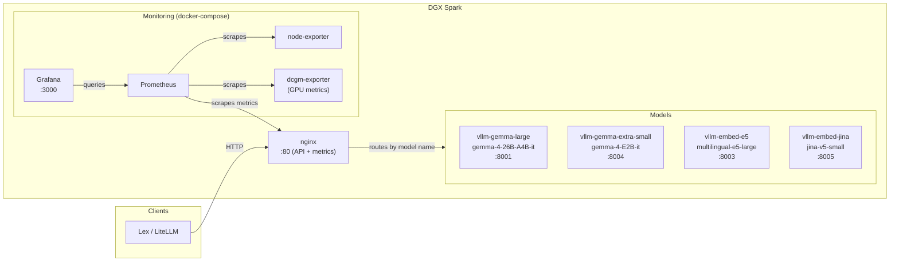

# lex-spark

Self-hosted LLM inference on a DGX Spark, powering the Lex platform. The server
exposes four models through an **OpenAI-compatible API** (chat, embeddings, and
completions) behind a single NGINX endpoint, with Prometheus + Grafana for
monitoring.

---

## Architecture at a glance



- **Port 80** — OpenAI-compatible API and vLLM metrics. NGINX reads the
  `"model"` field from every request body and forwards it to the right vLLM
  backend. Metrics are available at `/metrics/*` paths on the same port — no
  need to open additional ports. LiteLLM just needs to point at
  `http://DGX_SPARK_IP:80/v1`.
- **Port 3000** — Grafana (localhost only; tunnel/port-forward for remote access).

---

## Prerequisites

- **Python ≥ 3.12** and [`uv`](https://docs.astral.sh/uv/) (or pip) — for the
  model download script.
- **NVIDIA Container Toolkit** installed and working:
  ```bash
  nvidia-smi
  docker run --rm --gpus all nvidia/cuda:12.0-base nvidia-smi
  ```
- **A HuggingFace token** with access to gated models (Gemma family).
- **~80 GB of free disk space** for model weights (in `inference/models/`).

---

## Quick start

### 1. Configure environment

```bash
cd inference
cp .env.example .env
```

Edit `inference/.env` and fill in:
- `HF_TOKEN` — your HuggingFace token
- `MODEL_CACHE_PATH` — keep `./models` unless you have a reason to change it
- The four `*_MODEL` variables — verify the HuggingFace repo slugs are correct

```bash
cd ../observability
cp .env.example .env
```

Set a strong `GRAFANA_ADMIN_PASSWORD` (change the default).

### 2. Download model weights

```bash
cd inference
uv run download_models.py
```

This can take 30–60 minutes depending on network speed. The script downloads all
four models into `inference/models/`.

### 3. Pull Docker images

```bash
docker compose -f inference/docker-compose.yml pull
docker compose -f observability/docker-compose.yml pull
```

### 4. Launch the inference stack first

```bash
cd inference
docker compose up -d
```

Wait for all four vLLM containers to become healthy:

```bash
docker compose ps
# Look for "(healthy)" in the STATUS column — can take 2-5 min
```

### 5. Launch monitoring (optional)

```bash
cd ../observability
docker compose up -d
```

> **Why two stacks?** The observability services attach to the inference
> stack's Docker network (`dgx-inference_default`) as an *external* network.
> This keeps monitoring decoupled — you can bring it up/down without affecting
> inference.

### 6. Verify everything works

```bash
# Check NGINX health
curl http://localhost:80/health

# List available models
curl http://localhost:80/v1/models | jq

# Send a test chat request
curl http://localhost:80/v1/chat/completions \
  -H "Content-Type: application/json" \
  -d '{"model":"gemma-4-26B-A4B-it","messages":[{"role":"user","content":"Hi!"}]}'

# Check Prometheus targets are up
curl -s http://localhost:9090/api/v1/targets | jq '.data.activeTargets[].labels'
```

---

## What runs where

### Inference stack (`inference/docker-compose.yml`)

| Container | Model | Port (host) | Notes |
|---|---|---|---|
| `vllm-gemma-large` | Gemma 4 26B A4B (MoE) | 8001 | NVFP4-quantized, patched gemma4.py for MoE fix |
| `vllm-gemma-extra-small` | Gemma 4 E2B (dense) | 8004 | Lightweight, fast |
| `vllm-embed-e5` | multilingual-e5-large | 8003 | Text embeddings |
| `vllm-embed-jina` | jina-v5-small | 8005 | Text embeddings (long context) |
| `nginx` | — | **80** | Reverse proxy, model routing, metrics passthrough |

### Monitoring stack (`observability/docker-compose.yml`)

| Container | Purpose | Port |
|---|---|---|
| `prometheus` | Metrics collection (30-day retention, 10 GB cap) | 9090 (localhost) |
| `grafana` | Dashboards (pre-loaded with vLLM, node & GPU panels) | 3000 (localhost) |
| `node-exporter` | Host CPU/RAM/disk/network | — |
| `dcgm-exporter` | GPU utilisation, temperature, memory, power | — |

---

## How model routing works

NGINX reads the JSON body of every request, extracts the `"model"` field with a
regex, and forwards the request to the matching vLLM upstream:

```
POST /v1/chat/completions
Body: {"model": "gemma-4-26B-A4B-it", ...}
       → routed to vllm-gemma-large:8000

POST /v1/embeddings
Body: {"model": "multilingual-e5-large", ...}
       → routed to vllm-embed-e5:8000
```

### Adding a new model

1. Add the vLLM service to `inference/docker-compose.yml`
2. Add its upstream block and model name to the `$target` map in `nginx/nginx.conf`
3. Add it to the static `/v1/models` response in `nginx/nginx.conf`
4. Add a metrics location block (port 9100 server) in `nginx/nginx.conf`
5. Add a scrape config in `observability/prometheus/prometheus.yml`

---

## Monitoring & dashboards

### Accessing Grafana

Grafana is bound to `127.0.0.1:3000` — only accessible from the DGX itself. To
reach it from your workstation:

```bash
ssh -L 3000:localhost:3000 dgx-spark
# Then open http://localhost:3000 in your browser
```

Login with username `admin` and the password from `observability/.env`.

### Pre-loaded dashboards

| Dashboard | What it shows |
|---|---|
| **vLLM Official** | Request throughput, latency, tokens/s, KV cache usage, queue time |
| **Node Exporter Full** | CPU, memory, disk I/O, network traffic on the host |
| **NVIDIA DCGM Exporter** | GPU utilisation, memory, temperature, power draw per GPU |

### Prometheus endpoints (for reference)

vLLM metrics are available on **both** ports:
- **Port 80** (`/metrics/gemma-large`, `/metrics/embed-e5`, etc.) — for
  external consumers like a VPS-side Prometheus. Only port 80 needs to be open
  in the firewall.
- **Port 9100** (same paths) — internal Docker network only. The local
  Prometheus scrapes `nginx:9100` from inside the `dgx-inference` network.

The `/up` endpoint is also available on port 80 as a lightweight liveness check.

---

## Day-to-day operations

### Check everything is healthy

```bash
cd inference && docker compose ps
cd ../observability && docker compose ps
docker stats   # live resource view
```

### Watch logs

```bash
# All inference services
docker compose -f inference/docker-compose.yml logs -f

# Just one model
docker compose -f inference/docker-compose.yml logs -f vllm-gemma-large
```

### Restart a single model

```bash
docker compose -f inference/docker-compose.yml restart vllm-gemma-large
```

### Free GPU memory for testing

```bash
docker compose -f inference/docker-compose.yml stop vllm-gemma-large
# ... test with smaller models only ...
docker compose -f inference/docker-compose.yml start vllm-gemma-large
```

### Update vLLM images

```bash
docker compose -f inference/docker-compose.yml pull
docker compose -f inference/docker-compose.yml up -d
```

### Full teardown

```bash
docker compose -f observability/docker-compose.yml down
docker compose -f inference/docker-compose.yml down
# Model weights in inference/models/ are preserved
```

### Nuclear teardown (wipes model cache)

```bash
docker compose -f inference/docker-compose.yml down -v
```

---

## Troubleshooting

### Container stuck in "starting" (not healthy)

The healthcheck waits up to 180s for the large model. Check the container logs:

```bash
docker compose -f inference/docker-compose.yml logs vllm-gemma-large
```

Common causes:
- Model not downloaded yet (run `uv run download_models.py`)
- `HF_TOKEN` not set or invalid (check `inference/.env`)
- GPU out of memory (check `nvidia-smi` — the large model needs ~half a GPU)

### "Unknown or missing model" from NGINX

The model name in your request doesn't match the served model names. The valid
names are:

- `gemma-4-26B-A4B-it`
- `gemma-4-E2B-it`
- `multilingual-e5-large`
- `jina-v5-small`

### Grafana dashboards show "No data"

Check that Prometheus targets are up:

```bash
curl -s http://localhost:9090/api/v1/targets | jq '.data.activeTargets[] | {job: .labels.job, health: .health}'
```

If vLLM targets are down but models are running, the nginx metrics listener
(port 9100) may have failed — check `docker compose logs nginx`.

### Prometheus can't reach orchestrator targets

The `orchestrator-*` scrape targets point to hardcoded IPs that live outside
the DGX. These are expected to fail if those services are unreachable — it's
harmless and doesn't affect DGX monitoring.

---

## Known caveats

- **`gemma4_patched.py` fix**: The vLLM image has a bug in NVFP4 MoE expert
  parameter mapping for Gemma 4. The patched file is volume-mounted into the
  container. If you update the vLLM image, verify the patch still applies (the
  mount path is tied to Python 3.12 site-packages). Track the upstream fix at
  the vLLM GitHub repository.

- **NGINX buffers the full request body for model routing**: this means requests
  with very large message histories (>1 MB) will fail. If you hit this, increase
  `client_body_buffer_size` in `nginx/nginx.conf` (currently 1 MB).

- **No alerting configured**: Prometheus has no Alertmanager — nobody gets paged
  if a model goes down. This was intentionally left out; add Alertmanager
  configs in `observability/prometheus/` if needed.

- **Grafana dashboard datasources may need remapping**: On first launch, you
  may need to select "Prometheus" as the datasource in each dashboard's
  settings if they show "Datasource not found."

- **Two Docker Compose stacks**: They're intentionally separate so monitoring
  can be restarted independently. The observability stack references the
  inference stack's network (`dgx-inference_default`) as an external network,
  so inference must be started first.

- **GPU driver version is locked to ~580.x**: The standard vLLM image
  (`25.12-py3`) was chosen for compatibility. Don't upgrade the image without
  checking the driver requirements.
